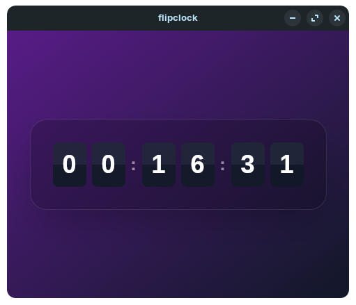

# Flip Clock Desktop & Mobile App

A beautiful clock application with smooth flip animations built using modern web technologies. The app features a sleek design with a frosted glass effect and responsive layout. Available for desktop and Android platforms.

> [!WARNING]
> This project is still a work in progress and may contain bugs or incomplete features.
>
> I am still learning how to use Tauri, so the codebase may not be optimal.



## Features

-   Real-time digital clock display
-   Smooth card flip animations for each digit
-   Responsive design that adapts to screen size
-   Modern frosted glass UI with gradient background
-   Cross-platform support (Desktop & Android)

## Tech Stack

-   [Tauri](https://tauri.app/) - Lightweight framework for building cross-platform applications
-   [SvelteKit](https://kit.svelte.dev/) - Full-stack JavaScript framework
-   [TailwindCSS](https://tailwindcss.com/) - Utility-first CSS framework

## Development Setup

### Desktop

1. Install dependencies:

```bash
npm install
```

2. Run in development mode:

```bash
npm run tauri dev
```

3. Build for production:

```bash
npm run tauri build
```

### Android

Requirements:

-   Android Studio
-   Android SDK (minimum SDK 24)
-   Rust Android targets

1. Add Android targets to Rust:

```bash
rustup target add aarch64-linux-android armv7-linux-androideabi i686-linux-android x86_64-linux-android
```

2. Open the Android project in android

3. Build using Android Studio or run:

```bash
./gradlew assembleDebug
```

4. The APK will be generated in `src-tauri/gen/android/app/build/outputs/apk/`

## Scripts

-   `npm run dev` - Start development server
-   `npm run build` - Build for production
-   `npm run preview` - Preview production build
-   `npm run check` - Type-check the codebase
-   `npm run tauri` - Run Tauri commands

## Contributing

1. Fork the repository
2. Create a new branch
3. Make your changes
4. Submit a pull request

## Acknowledgments

-   [Tauri Apps](https://github.com/tauri-apps) for the amazing framework
-   [SvelteKit](https://github.com/sveltejs/kit) for the robust dev experience
-   [TailwindCSS](https://github.com/tailwindlabs/tailwindcss) for the utility classes
